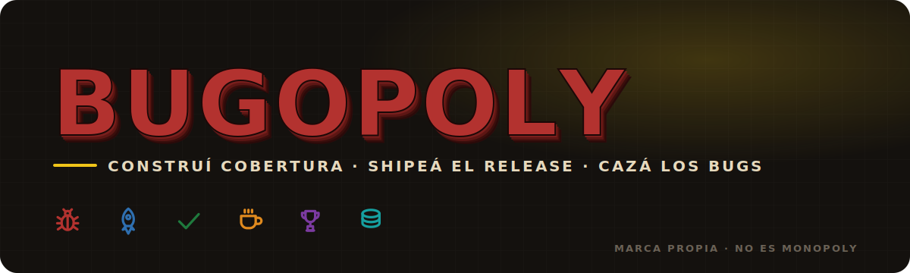
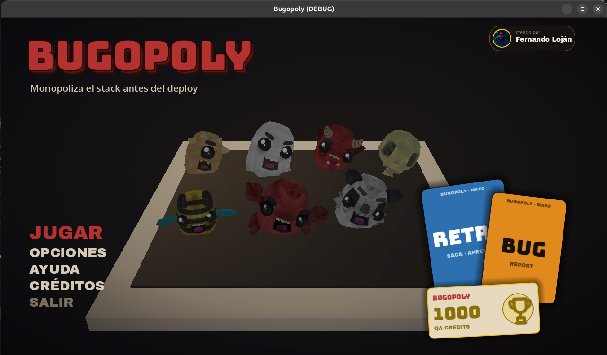

<p align="center">
  
</p>

<p align="center">
  
  
  
  
  
</p>

# Bugopoly

Juego de mesa digital en 3D con temática de **QA de software y programación**. NO es Monopoly: es marca propia. Comprás módulos de software, construís **cobertura de tests hacia CI/CD**, cazás bugs, esquivás la deuda técnica y corrés para **shipear el release**.

Hecho con **Godot Engine 4.6**. Jugable en multijugador local (hot-seat con bots) y en modo autoplay.

<p align="center">
  
</p>

## Características

- **Tablero 3D** estilo juego de mesa premium, 40 casillas, con fichas-monstruo animadas (**21 para elegir**) y centro oscuro con logo + ciudad de software.
- **Propiedades = módulos de software** por subsistema: al **comprar**, un tractor aplana el lote y queda el cimiento con el color del dueño; al **desarrollar**, crecen edificios (cobertura de tests → CI/CD) con polvo y sube la renta.
- **Deuda Técnica**: se acumula y cobra interés cada turno; se refactoriza/paga en el Coffee Break.
- **Retos QA** reales (severidad vs prioridad, valores límite, TDD, idempotencia…) que otorgan **cartas de habilidad**:
  - **Hotfix** — limpia tu deuda técnica.
  - **Rollback** — recuperás tu último gasto.
  - **Feature Flag** — tu próxima renta es gratis.
- **Cartas Bug / Retro** con cara del Art Kit: salen del mazo y se agrandan hacia la pantalla, con el icono del kit en el centro.
- **Billetes "QA Credits"** texturizados con denominación (10/50/100/500/1000, color por valor) que vuelan hacia la pantalla al cobrar/pagar.
- **Casillas especiales** con iconos del kit (Salida, Bug Report, Reto QA, Deuda Técnica, Bloqueado, On-Call, Coffee Break, Incidente en Prod, Retro); las propiedades muestran icono de subsistema y descripción QA al comprar.
- **Vida en el tablero**: multitud de monstruos bailando + espectadores animados (saludan, pelean) alrededor; cámara con órbita lenta; anillo en la ficha del turno.
- **Pantalla de fin de partida** con stats y logros.
- **Menú**: título con extrude 3D, mini-tablero con monstruos bailando, baraja Bug/Retro y billete QA Credits de marca, música, y secciones de Ayuda y Créditos.
- **Comercio entre jugadores**: proponé intercambios (una propiedad por otra + pago extra); el rival acepta si le conviene.
- **Panel de propiedades** (módulos por jugador con cobertura y renta) y **log lateral** persistente de jugadas.
- **Opciones** de audio (música / sonidos / voces por separado) y de gráficos (antialiasing, escala de render, sombras, glow, fullscreen, vsync), que **se guardan en disco** entre partidas.
- **App icon propio** (cíclope de marca) y **optimizado para GPU integrada** (renderer Mobile, carga lazy, caché de materiales y texturas).
- **Data-driven y moddeable**: tablero, cartas, retos, fichas y subsistemas viven en JSON bajo `data/` y `mods/`.

## Cómo correr

Necesitás **Godot 4.6**.

```bash
godot --path .
```

Modo autoplay (los bots juegan solos):

```bash
BUGOPOLY_AUTOPLAY=1 godot --path .
```

> En la primera corrida Godot importa los assets. Algunos modelos `.gltf` y sonidos se cargan en runtime, así que pueden tardar un toque al abrir el menú o entrar a la partida.

## Multiplataforma (PC · Web · Android)

`export_presets.cfg` ya trae presets para **Linux, Windows, macOS, Web y Android** (binario autocontenido / icono incluido). En todos, una sola vez: **Editor → Gestionar plantillas de exportación → Descargar**.

**PC (Linux / Windows / macOS):**

```bash
godot --headless --export-release "Linux" build/bugopoly.x86_64
godot --headless --export-release "Windows Desktop" build/bugopoly.exe
godot --headless --export-release "macOS" build/bugopoly.dmg
```

Para un instalador `.exe` (opcional), envolvé el binario con Inno Setup o NSIS.

**Web (lo más fácil de compartir, corre en navegador incluido el del celu):**

```bash
godot --headless --export-release "Web" build/web/index.html
```

Subí la carpeta `build/web/` a itch.io o GitHub Pages.

**Android (APK):** se genera con el script incluido (necesita Android SDK + JDK 17 + plantillas de export):

```bash
ANDROID_HOME=~/Android/Sdk DISPLAY=:0 godot --editor --path . -s tools/export_android.gd
```

Sale `build/bugopoly.apk` (arm64-v8a, ~27 MB, package `com.bugopoly.game`), **firmado con la debug key** → se instala por *sideload* en el celu (Ajustes → permitir "orígenes desconocidos", copiar el APK y tocarlo). El renderer es **Mobile**, la orientación está fijada a horizontal y el icono incluido.

> Por qué el script y no `--export-debug`: en Godot 4.6.3 el `can_export` del CLI **rechaza el preset Android con un error vacío** (bug); `export_project()` por scripting lo esquiva y construye el APK correcto. PC y Web sí exportan por CLI normal.

Los builds salen en `build/` (ignorado por git). El layout usa `stretch=keep`, así que se centra sin descuadrarse en cualquier resolución/celular.

## Identidad de marca

Sistema de marca completo (logo, app icon, cartas, billetes "QA Credits", tablero, tipografías) en [`docs/brand/BUGOPOLY-Art-Kit.dc.html`](docs/brand/BUGOPOLY-Art-Kit.dc.html).

**Paleta base**


**Colores de subsistema**


**Tipografías:** Bungee (display) + Archivo Black (UI).
**Iconografía:** set de 21 line-icons recolorables en `assets/bugopoly/icons/` (bug, search, rocket, wrench, shield, bell, server, database, git-branch, terminal, coins, credit-card, trophy, dice, lock, gear, refresh, coffee, alert, cage, circle-check).

## Estructura

```
data/            contenido data-driven (tablero, cartas, retos, fichas, subsistemas)
mods/            mods de ejemplo (qa_extras)
docs/brand/      Art Kit de marca (Claude Design) + banner
src/
  core/          autoloads: registry, game_state, audio, gfx_settings, event_bus
  presentation/  board_view, decor, dice, camera_rig (render 3D)
  simulation/    player
  ui/            hud, palette (sistema de marca)
  world/         start_screen (menú), main (partida)
assets/bugopoly/ modelos, sonidos, música, texturas, iconos, fuentes
```

## Roadmap

- [x] Título del menú con extrude 3D + app icon de marca.
- [x] Cartas (Bug/Retro/propiedad) y billetes "QA Credits" in-game con el Art Kit.
- [x] Tractor de construcción, multitud de monstruos y espectadores animados.
- [x] Comercio entre jugadores, panel de propiedades y log lateral.
- [x] Guardar opciones (audio/gráficos) en disco; +13 retos QA (30+ en total).
- [x] Captura del menú en el README (faltan GIF de gameplay y del tablero).
- [ ] Más cartas y eventos; balance de partida.
- [ ] Build exportado descargable (preset listo en `export_presets.cfg`).

## Créditos / licencias de assets

Todos libres para uso comercial:

- **Monstruos y personajes** — Quaternius (CC0)
- **Edificios y props** — Kenney (CC0)
- **Texturas de madera** — Poly Haven (CC0)
- **Música de menú** — "Chill Main Menu music" vía OpenGameArt (CC0)
- **Sonidos y voces** — Kenney (CC0)
- **Fuentes** — Bungee y Archivo Black (Google Fonts, OFL)
- **Sistema de marca / iconos** — generados con Claude Design
- **Motor** — Godot Engine (MIT)

---

<p align="center"><sub>BUGOPOLY · marca propia — no es Monopoly</sub></p>
